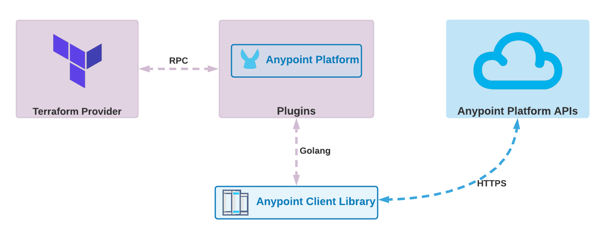
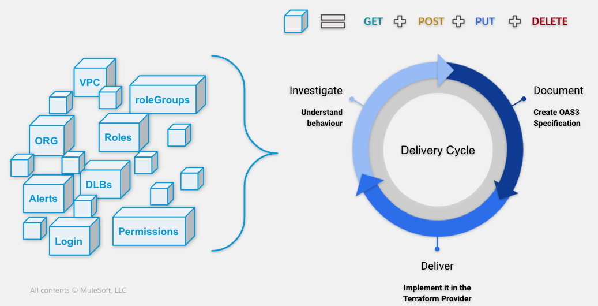

# Terraform Provider Anypoint

This is the first terraform provider for anypoint platform! We aim to provide a sustainable tool to automate your actions in anypoint.

This project was initiated by Mulesoft's consultants and architects from the professional team. We welcome any volunteers interested in joining the initiative no matter where you're from !

## How it works

This provider uses the anypoint platform APIs to perform actions for each one of the implemented resources.



We use the **anypoint client library** as an abstraction layer to perform actions on the platform.

For better maintainability and in order to speed up the development process, the **anypoint client library** is a library generated from OAS3 specifications written by the community.

The following image describes the delivery cycle:



The cycle is composed of 3 steps:

  1. Pick one resource and understand how it works using tools like Postman, anypoint's documentation and your favorite browser's inspector.
  2. Create the OAS3 specification. The specification should at least contain GET, POST and DELETE operations.
  The specification should be contributed [here](https://github.com/mulesoft-consulting/anypoint-automation-client-generator). Using the OAS spec, a go module will be generated and pushed [here](https://github.com/mulesoft-consulting/anypoint-client-go).
  
  
  3. Implement the resource and related data sources in the provider using the generated library.

## How to use

Run the following command to build the provider

```bash
go build -o terraform-provider-anypoint
```

**N.B:** As of Go 1.13 make sure that your `GOPRIVATE` environment variable includes `github.com/mulesoft-consulting`

```bash
go env -w GOPRIVATE=github.com/mulesoft-consulting
```

## Test sample configuration

First, build and install the provider.

```bash
make install
```

Then, navigate inside the `examples` folder, and update your credentials in `main.tf`.
Run the following command to initialize the workspace and apply the sample configuration.

```bash
terraform init && terraform apply
```

If you prefer to have your credentials in a separate file, create a `params.tfvars.json` file in the `examples` folder. Then add your parameters as shown in the example below:

```json
{
  "client_id": "REMPLACE_HERE",
  "client_secret": "REMPLACE_HERE",
  "org_id": "REMPLACE_HERE"
}
```

Make sure to add the params file when you apply your terraform configuration as follow:

```bash
terraform init && terraform apply -var-file="params.tfvars.json"
```

## Debugging mode

First build the project using

```bash
go build
```

You should have a new file `terraform-provider-anypoint` in the root of the project. To start the provider in debug mode execute the following:

```bash
dlv exec --headless ./terraform-provider-anypoint -- --debug
```

Once executed, connect your debugger (whether it's your IDE or the debugger client) to the debugger server. The following is an example of how to start a client debugger:

```bash
dlv connect 127.0.0.1:51495
```

Then have your client debugger `continue` execution (check the help for more info) then your provider should print something like:

```bash
TF_REATTACH_PROVIDERS='{"anypoint.mulesoft.com/automation/anypoint":{"Protocol":"grpc","Pid":69612,"Test":true,"Addr":{"Network":"unix","String":"/var/folders/yc/k0_j_x0945jdthsw7fzw5ysh0000gp/T/plugin598168131"}}}'
```

Now you can run terraform using the debugger, here's an example:

```bash
TF_REATTACH_PROVIDERS='{"anypoint.mulesoft.com/automation/anypoint":{"Protocol":"grpc","Pid":69612,"Test":true,"Addr":{"Network":"unix","String":"/var/folders/yc/k0_j_x0945jdthsw7fzw5ysh0000gp/T/plugin598168131"}}}' terraform apply --auto-approve -var-file="params.tfvars.json"
```

### How to log

Use `log` package to log. Here's an exampe:

```go
log.Println("[DEBUG] Something happened!")
```

## Documentation

In order to generate a documentation, we use [tfplugindocs](https://github.com/hashicorp/terraform-plugin-docs).

## Create Release

Follow [documentation](https://www.terraform.io/docs/registry/providers/publishing.html#using-goreleaser-locally).

## How to contribute

You can contribute by:

* Testing the tool and letting us know of any problems you encounter.
* Contributing specifications for resources [here](https://github.com/mulesoft-consulting/anypoint-automation-client-generator).
* Contributing code in the provider itself here.

## Credits

Made with love.

## Disclaimer

**This is an [UNLICENSED software, please review the considerations](UNLICENSE.md).**
This is an open source project, it does not form part of the official MuleSoft product stack, and is therefore not included in MuleSoft support SLAs. Issues should be directed to the community, who will try to assist on a best endeavours basis. This application is distributed **as is**.
